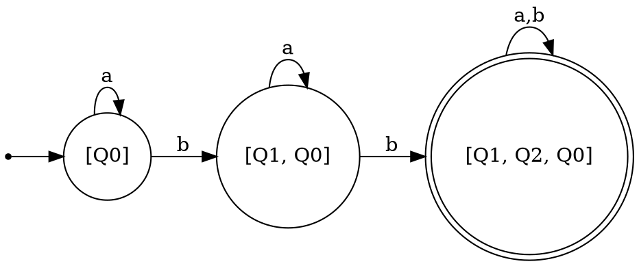

# Determinism in Finite Automata. Conversion from NDFA 2 DFA. Chomsky Hierarchy.

### Course: Formal Languages & Finite Automata
### Author: Saban Olga

----

## Theory

A finite automaton is a theoretical model of computation using a finite number of states to perform computation. It is composed of a set of states, input alphabet, transition function, start state, and set of final states. The automaton reads the input string from left to right, state by state, using the transition function to change its state during computation. Once the input string is read, if the automaton reaches its final state, the input string is accepted.

Finite automata are classified into deterministic finite automata (DFA) and non-deterministic finite automata (NDFA) based on whether the automaton is deterministic or non-deterministic, respectively. In a DFA, for a given state and input symbol, the automaton makes a transition from its current state to exactly one next state. In NDFA, the automaton makes several transitions from its current state for a given input symbol. Despite the difference in their functioning, both types of finite automata recognize the same class of languages.

Finite automata can be considered equivalent to regular grammars. A regular grammar is defined by production rules A → aB or A → a. Regular grammars constitute Type 3 grammars according to the Chomsky hierarchy. Any finite automaton can be converted to an equivalent regular grammar. Moreover, an NDFA can be converted to a DFA with the help of the subset construction algorithm.

---

## Objectives
Finite automata can be considered equivalent to regular grammars. A regular grammar is defined by production rules A → aB or A → a. Regular grammars constitute Type 3 grammars according to the Chomsky hierarchy. Any finite automaton can be converted to an equivalent regular grammar. Moreover, an NDFA can be converted to a DFA with the help of the subset construction algorithm.

---

## Implementation Description

The project was implemented in Java using an object-oriented structure. The solution consists of three main classes: `FiniteAutomaton`, `RegularGrammar`, and `Main`.

The `FiniteAutomaton` class models the automaton by storing the states, alphabet, transition function, start state, and final states. Transitions are implemented using a nested map structure that allows multiple possible next states for the same state and input symbol, which enables representation of non-deterministic behavior.

The method used to check determinism verifies whether any transition contains more than one possible next state.

```java
public boolean isDeterministic() {
    for (String state : transitions.keySet()) {
        for (String symbol : transitions.get(state).keySet()) {
            if (transitions.get(state).get(symbol).size() > 1) {
                return false;
            }
        }
    }
    return true;
}
```

The conversion from finite automaton to regular grammar iterates through all transitions. For each transition of the form δ(qi, a) = qj, a production rule qi → a qj is created. If qj is a final state, an additional production qi → a is added.

The `RegularGrammar` class stores non-terminals, terminals, productions, and the start symbol. The grammar classification method verifies whether the productions follow the format required for a regular grammar.

```java
public String classifyGrammar() {
    boolean isRegular = true;

    for (String left : productions.keySet()) {
        for (String right : productions.get(left)) {
            if (right.length() > 2) {
                isRegular = false;
            }
        }
    }

    if (isRegular)
        return "Type 3 — Regular Grammar";

    return "Type 2 — Context-Free Grammar";
}
```

The NDFA to DFA conversion is implemented using the subset construction algorithm. In this approach, each DFA state represents a set of NDFA states. The algorithm starts from the initial state and generates new composite states until no additional states can be formed.

The `Main` class initializes the automaton for Variant 24:

Q = {Q0, Q1, Q2}  
Σ = {a, b}  
F = {Q2}

It adds all transitions, checks determinism, converts the automaton into a regular grammar, converts the NDFA into a DFA, and prints the results.

```java
public static void main(String[] args) {

    Set<String> states = Set.of("Q0", "Q1", "Q2");
    Set<String> alphabet = Set.of("a", "b");
    Set<String> finalStates = Set.of("Q2");

    FiniteAutomaton fa =
            new FiniteAutomaton(states, alphabet, "Q0", finalStates);

    fa.addTransition("Q0", "b", "Q0");
    fa.addTransition("Q0", "b", "Q1");
    fa.addTransition("Q1", "b", "Q2");
    fa.addTransition("Q0", "a", "Q0");
    fa.addTransition("Q1", "a", "Q1");
    fa.addTransition("Q2", "a", "Q2");
}
```

After applying subset construction, the resulting DFA contains the states:

[Q0]  
[Q1, Q0]  
[Q1, Q2, Q0]

The state [Q1, Q2, Q0] is final because it contains Q2, which is a final state in the original automaton.

The graphical representation of the DFA using Graphviz is shown below:



---

## Conclusions

The automaton provided in Variant 24 was identified as non-deterministic because state Q0 has two transitions for the input symbol b. The automaton was successfully converted into a regular grammar, which satisfies the requirements of a Type 3 grammar in the Chomsky hierarchy. The NDFA was also converted into an equivalent DFA using the subset construction algorithm. The resulting DFA recognizes the same language as the original automaton.

This laboratory work demonstrates the theoretical equivalence between finite automata and regular grammars and confirms that non-determinism can be eliminated through systematic transformation.

---

## References

Hopcroft, J. E., Motwani, R., Ullman, J. D. Introduction to Automata Theory, Languages, and Computation.  
Course materials for Formal Languages & Finite Automata:
https://drive.google.com/file/d/1rBGyzDN5eWMXTNeUxLxmKsf7tyhHt9Jk/view
https://else.fcim.utm.md/pluginfile.php/64791/mod_resource/content/0/Chapter_2.pdf
Graphviz Documentation: https://graphviz.org/